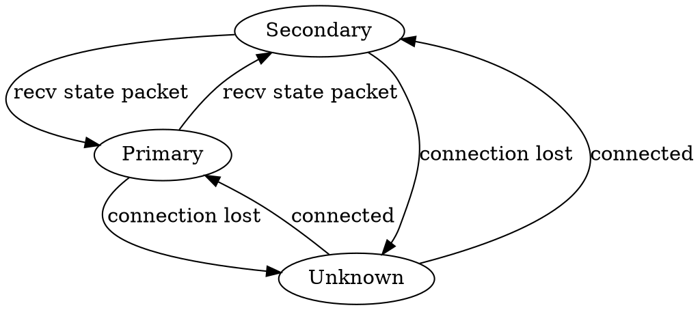

# peer-states-8.dot

### ファイル情報

- パス: `linux-v6.12/Documentation/admin-guide/blockdev/drbd/peer-states-8.dot`

### コンテンツ

```dot
digraph peer_states {
	Secondary -> Primary           [ label = "recv state packet" ]
	Primary   -> Secondary 	       [ label = "recv state packet" ]
	Primary   -> Unknown 	       [ label = "connection lost" ]
	Secondary  -> Unknown  	       [ label = "connection lost" ]
	Unknown   -> Primary           [ label = "connected" ]
	Unknown   -> Secondary         [ label = "connected" ]
}

```
